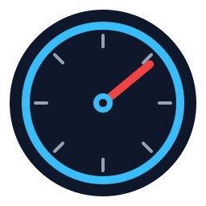

# Outrider TPMS — Home Assistant integration

Home Assistant integration for the [Outrider Components](https://www.outridercomponents.com/) Bluetooth Low Energy tire pressure sensors. Installable via [HACS](https://hacs.xyz).

## What it does

- Auto-detects Outrider sensors (advertised as `OutriderF` / `OutriderR`) via Home Assistant's native Bluetooth integration — no manual YAML.
- Connects to each sensor over BLE, subscribes to its pressure notifications, and exposes the reading as a standard `sensor.*` entity.
- One Home Assistant device per wheel. Front and rear are separate config entries.

## Entities per sensor

| Entity | Unit | Default | Description |
|---|---|---|---|
| Pressure | PSI | enabled | Gauge pressure (what a floor pump reads). HA auto-converts to your display unit if set. |
| Absolute pressure | PSI | disabled | Raw absolute pressure before subtracting 1 atm — diagnostic. |
| Signal strength | dBm | disabled | Last observed RSSI — diagnostic. |

## Requirements

- Home Assistant 2024.8 or later.
- A Bluetooth adapter that Home Assistant's `bluetooth` integration can reach. An [ESPHome Bluetooth proxy](https://esphome.io/components/bluetooth_proxy.html) placed near where you park the bike works well.
- Sensors must be awake (wheel motion triggers the accelerometer). They go back to sleep when the bike is still, so readings update only while you're riding or just after.

## Installation (HACS)

1. HACS → Integrations → custom repositories → add `https://github.com/Leicas/outrider-tpms` as type `Integration`.
2. Install "Outrider TPMS".
3. Restart Home Assistant.
4. Move the bike to wake the sensors. Home Assistant's Bluetooth integration will discover them and prompt you to add each one from the notifications panel.

## Manual installation

Copy `custom_components/outrider_tpms/` into your Home Assistant `config/custom_components/` directory and restart.

## Protocol

See [`PROTOCOL.md`](./PROTOCOL.md) for the reverse-engineered GATT protocol.

## Disclaimer

Not affiliated with or endorsed by Outrider Components. Provided as-is; tire pressure is safety-critical — do not rely on this integration for decisions you wouldn't make with a glance at the floor pump.
